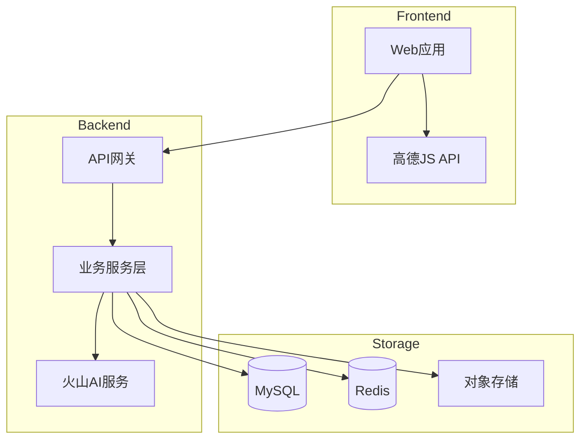

# Design Document: 旅游规划模块

## Overview

旅游规划模块是一个企业级旅行路线规划系统，基于 Vue 3 + Go 技术栈构建，集成高德地图API和火山AI。

### 技术栈
- **前端**: Vue 3 + TypeScript + Element Plus + Pinia + 高德地图 JS API 2.0
- **后端**: Go 1.24 + Gin + GORM + MySQL
- **AI服务**: 火山引擎AI
- **存储**: MySQL + Redis + OSS

## Architecture



## Components and Interfaces

### 前端目录结构
```
src/views/travel/
├── map/index.vue           # 地图主视图
├── roadbook/
│   ├── list/index.vue      # 路书列表
│   ├── detail/index.vue    # 路书详情
│   ├── editor/index.vue    # 路书编辑器
│   └── explore/index.vue   # 路书广场
├── ai/index.vue            # AI规划页面
├── template/index.vue      # 模板库
├── components/             # 子组件
├── composables/            # 组合式函数
├── store/                  # 状态管理
├── api/                    # API接口
└── types/                  # 类型定义
```

### 后端目录结构
```
internal/
├── api/travel/             # API处理器
├── model/                  # 数据模型
├── repository/             # 数据访问层
├── service/travel/         # 业务服务层
└── dto/travel/             # 数据传输对象
```

### API接口设计

| 方法 | 路径 | 描述 |
|------|------|------|
| POST | /api/v1/travel/roadbooks | 创建路书 |
| GET | /api/v1/travel/roadbooks | 获取路书列表 |
| GET | /api/v1/travel/roadbooks/:id | 获取路书详情 |
| PUT | /api/v1/travel/roadbooks/:id | 更新路书 |
| DELETE | /api/v1/travel/roadbooks/:id | 删除路书 |
| POST | /api/v1/travel/roadbooks/:id/waypoints | 添加途经点 |
| PUT | /api/v1/travel/roadbooks/:id/waypoints | 批量更新途经点 |
| POST | /api/v1/travel/roadbooks/:id/comments | 发表评论 |
| GET | /api/v1/travel/roadbooks/:id/comments | 获取评论列表 |
| POST | /api/v1/travel/roadbooks/:id/favorite | 收藏路书 |
| POST | /api/v1/travel/roadbooks/:id/share | 生成分享链接 |
| GET | /api/v1/travel/roadbooks/:id/nav-link | 生成导航链接 |
| GET | /api/v1/travel/explore | 路书广场 |
| GET | /api/v1/travel/search | 搜索路书 |
| GET | /api/v1/travel/tags | 获取标签列表 |
| POST | /api/v1/travel/ai/plan | AI生成行程 |
| POST | /api/v1/travel/ai/chat | AI助手对话 |
| GET | /api/v1/travel/templates | 获取模板列表 |
| POST | /api/v1/travel/templates/:id/use | 使用模板 |

## Data Models

### 数据库表结构

```sql
-- 路书表
CREATE TABLE roadbooks (
    id BIGINT UNSIGNED PRIMARY KEY AUTO_INCREMENT,
    user_id BIGINT UNSIGNED NOT NULL,
    title VARCHAR(100) NOT NULL,
    description TEXT,
    cover_url VARCHAR(500),
    start_date DATE,
    end_date DATE,
    visibility TINYINT DEFAULT 1,
    travel_mode VARCHAR(20) DEFAULT 'driving',
    total_distance INT DEFAULT 0,
    total_duration INT DEFAULT 0,
    total_budget DECIMAL(10,2) DEFAULT 0,
    view_count INT UNSIGNED DEFAULT 0,
    favorite_count INT UNSIGNED DEFAULT 0,
    like_count INT UNSIGNED DEFAULT 0,
    comment_count INT UNSIGNED DEFAULT 0,
    share_count INT UNSIGNED DEFAULT 0,
    status TINYINT DEFAULT 1,
    created_at TIMESTAMP DEFAULT CURRENT_TIMESTAMP,
    updated_at TIMESTAMP DEFAULT CURRENT_TIMESTAMP ON UPDATE CURRENT_TIMESTAMP,
    deleted_at TIMESTAMP NULL,
    INDEX idx_user_id (user_id),
    INDEX idx_visibility_status (visibility, status),
    FULLTEXT INDEX ft_title_desc (title, description)
) ENGINE=InnoDB DEFAULT CHARSET=utf8mb4;

-- 途经点表
CREATE TABLE roadbook_waypoints (
    id BIGINT UNSIGNED PRIMARY KEY AUTO_INCREMENT,
    roadbook_id BIGINT UNSIGNED NOT NULL,
    name VARCHAR(100) NOT NULL,
    address VARCHAR(300),
    longitude DECIMAL(10, 7) NOT NULL,
    latitude DECIMAL(10, 7) NOT NULL,
    poi_id VARCHAR(50),
    poi_type VARCHAR(50),
    day_index INT DEFAULT 1,
    sort_order INT DEFAULT 0,
    stay_duration INT DEFAULT 60,
    budget DECIMAL(10,2) DEFAULT 0,
    notes TEXT,
    images JSON,
    waypoint_type TINYINT DEFAULT 2,
    created_at TIMESTAMP DEFAULT CURRENT_TIMESTAMP,
    updated_at TIMESTAMP DEFAULT CURRENT_TIMESTAMP ON UPDATE CURRENT_TIMESTAMP,
    INDEX idx_roadbook_id (roadbook_id),
    FOREIGN KEY (roadbook_id) REFERENCES roadbooks(id) ON DELETE CASCADE
) ENGINE=InnoDB DEFAULT CHARSET=utf8mb4;

-- 标签表
CREATE TABLE roadbook_tags (
    id BIGINT UNSIGNED PRIMARY KEY AUTO_INCREMENT,
    name VARCHAR(50) NOT NULL UNIQUE,
    color VARCHAR(20) DEFAULT '#409EFF',
    use_count INT UNSIGNED DEFAULT 0,
    is_system TINYINT DEFAULT 0,
    created_at TIMESTAMP DEFAULT CURRENT_TIMESTAMP
) ENGINE=InnoDB DEFAULT CHARSET=utf8mb4;

-- 标签关联表
CREATE TABLE roadbook_tag_relations (
    id BIGINT UNSIGNED PRIMARY KEY AUTO_INCREMENT,
    roadbook_id BIGINT UNSIGNED NOT NULL,
    tag_id BIGINT UNSIGNED NOT NULL,
    created_at TIMESTAMP DEFAULT CURRENT_TIMESTAMP,
    UNIQUE KEY uk_roadbook_tag (roadbook_id, tag_id)
) ENGINE=InnoDB DEFAULT CHARSET=utf8mb4;

-- 评论表
CREATE TABLE roadbook_comments (
    id BIGINT UNSIGNED PRIMARY KEY AUTO_INCREMENT,
    roadbook_id BIGINT UNSIGNED NOT NULL,
    user_id BIGINT UNSIGNED NOT NULL,
    parent_id BIGINT UNSIGNED DEFAULT 0,
    content VARCHAR(500) NOT NULL,
    like_count INT UNSIGNED DEFAULT 0,
    created_at TIMESTAMP DEFAULT CURRENT_TIMESTAMP,
    deleted_at TIMESTAMP NULL,
    INDEX idx_roadbook_id (roadbook_id)
) ENGINE=InnoDB DEFAULT CHARSET=utf8mb4;

-- 收藏表
CREATE TABLE roadbook_favorites (
    id BIGINT UNSIGNED PRIMARY KEY AUTO_INCREMENT,
    user_id BIGINT UNSIGNED NOT NULL,
    roadbook_id BIGINT UNSIGNED NOT NULL,
    created_at TIMESTAMP DEFAULT CURRENT_TIMESTAMP,
    UNIQUE KEY uk_user_roadbook (user_id, roadbook_id)
) ENGINE=InnoDB DEFAULT CHARSET=utf8mb4;

-- 分享记录表
CREATE TABLE roadbook_shares (
    id BIGINT UNSIGNED PRIMARY KEY AUTO_INCREMENT,
    roadbook_id BIGINT UNSIGNED NOT NULL,
    user_id BIGINT UNSIGNED NOT NULL,
    share_code VARCHAR(32) NOT NULL UNIQUE,
    share_type TINYINT DEFAULT 1,
    visit_count INT UNSIGNED DEFAULT 0,
    expires_at TIMESTAMP NULL,
    created_at TIMESTAMP DEFAULT CURRENT_TIMESTAMP
) ENGINE=InnoDB DEFAULT CHARSET=utf8mb4;

-- 路书模板表
CREATE TABLE roadbook_templates (
    id BIGINT UNSIGNED PRIMARY KEY AUTO_INCREMENT,
    roadbook_id BIGINT UNSIGNED NOT NULL,
    user_id BIGINT UNSIGNED NOT NULL,
    title VARCHAR(100) NOT NULL,
    description TEXT,
    cover_url VARCHAR(500),
    destination VARCHAR(100),
    days INT NOT NULL,
    category TINYINT DEFAULT 1,
    use_count INT UNSIGNED DEFAULT 0,
    status TINYINT DEFAULT 0,
    created_at TIMESTAMP DEFAULT CURRENT_TIMESTAMP
) ENGINE=InnoDB DEFAULT CHARSET=utf8mb4;

-- 统计日表
CREATE TABLE roadbook_stats_daily (
    id BIGINT UNSIGNED PRIMARY KEY AUTO_INCREMENT,
    roadbook_id BIGINT UNSIGNED NOT NULL,
    stat_date DATE NOT NULL,
    view_count INT UNSIGNED DEFAULT 0,
    favorite_count INT UNSIGNED DEFAULT 0,
    share_count INT UNSIGNED DEFAULT 0,
    UNIQUE KEY uk_roadbook_date (roadbook_id, stat_date)
) ENGINE=InnoDB DEFAULT CHARSET=utf8mb4;
```


## Correctness Properties

*A property is a characteristic or behavior that should hold true across all valid executions of a system.*

### Property 1: 路书数据持久化 Round-Trip
*For any* 有效的路书数据，保存到数据库后通过ID查询，应该得到与原始数据一致的路书信息。
**Validates: Requirements 3.2, 14.3**

### Property 2: 路书列表按时间倒序排列
*For any* 用户的路书列表查询结果，列表中每个路书的创建时间应该大于或等于其后一个路书的创建时间。
**Validates: Requirements 3.3**

### Property 3: 路书软删除后不可查询
*For any* 已删除的路书，通过常规查询接口应该无法获取该路书数据。
**Validates: Requirements 3.4**

### Property 4: 途经点数据完整性
*For any* 添加到路书的途经点，查询时应包含完整的名称、经纬度坐标、停留时间和备注信息。
**Validates: Requirements 3.5**

### Property 5: 途经点按天分组正确性
*For any* 包含多日行程的路书，按天分组后每个分组内的所有途经点的 dayIndex 值应该相同。
**Validates: Requirements 4.3**

### Property 6: 收藏计数正确性
*For any* 路书的收藏操作，收藏后路书的 favoriteCount 应增加1，取消收藏后应减少1。
**Validates: Requirements 4.4**

### Property 7: 评论数据持久化 Round-Trip
*For any* 有效的评论内容，保存后查询应返回相同的评论内容、用户ID和路书ID。
**Validates: Requirements 5.1**

### Property 8: 评论列表按时间倒序排列
*For any* 路书的评论列表查询结果，列表中每条评论的创建时间应该大于或等于其后一条评论的创建时间。
**Validates: Requirements 5.2**

### Property 9: 评论父子关系有效性
*For any* 回复评论（parentId > 0），其 parentId 指向的父评论应该存在且属于同一路书。
**Validates: Requirements 5.3**

### Property 10: 评论内容验证
*For any* 评论内容字符串，如果长度超过500字符或仅包含空白字符，验证函数应返回失败。
**Validates: Requirements 5.5**

### Property 11: 高德导航链接格式正确性
*For any* 途经点列表和导航模式，生成的高德导航链接应符合 URI Scheme 规范。
**Validates: Requirements 6.1, 6.4**

### Property 12: 导航链接途经点顺序保持
*For any* 有序的途经点列表，从生成的导航链接中解析出的坐标顺序应与原始列表顺序一致。
**Validates: Requirements 6.2**

### Property 13: 途经点数量超限检测
*For any* 包含超过16个途经点的路书，导航导出功能应返回分段导航信息。
**Validates: Requirements 6.3**

### Property 14: 分享码唯一性
*For any* 两次独立的分享操作，生成的分享码应该不同。
**Validates: Requirements 7.1**

### Property 15: 分享访问计数递增
*For any* 分享链接，每次被访问后其访问计数应该比访问前增加1。
**Validates: Requirements 7.3**

### Property 16: 搜索筛选结果正确性
*For any* 搜索查询，返回的所有路书应满足筛选条件。
**Validates: Requirements 8.2, 8.3**

### Property 17: 事务一致性保证
*For any* 路书保存操作，如果途经点保存失败，则路书主表数据也不应该被保存。
**Validates: Requirements 14.1**

### Property 18: 分页查询数量限制
*For any* 路书列表分页查询，返回的数据条数应该不超过请求的 pageSize，且最大值为100。
**Validates: Requirements 14.2**

### Property 19: 私有路书访问权限验证
*For any* 私有路书和非所有者用户的访问请求，系统应返回403状态码。
**Validates: Requirements 15.1, 15.2**

### Property 20: 路书所有权验证
*For any* 路书的编辑或删除操作，如果请求用户不是路书所有者，操作应被拒绝。
**Validates: Requirements 15.3**

## Error Handling

| 错误类型 | HTTP状态码 | 处理方式 |
|----------|------------|----------|
| 参数验证失败 | 400 | 返回具体字段错误信息 |
| 未授权访问 | 401 | 返回登录提示 |
| 权限不足 | 403 | 返回权限不足提示 |
| 资源不存在 | 404 | 返回资源不存在提示 |
| 数据库操作失败 | 500 | 记录日志，返回通用错误 |
| AI服务调用失败 | 502 | 返回服务暂不可用 |

## Testing Strategy

### 测试框架
- **前端**: Vitest + Vue Test Utils + fast-check
- **后端**: Go testing + testify + gopter

### 属性测试标注格式
```
**Feature: travel-planner, Property {number}: {property_text}**
```

### 关键属性测试
1. Round-Trip 属性测试：路书数据、评论数据
2. 排序属性测试：路书列表、评论列表
3. 计数属性测试：收藏计数、访问计数
4. 验证属性测试：评论内容、权限验证
5. 链接生成属性测试：导航链接格式、途经点顺序
